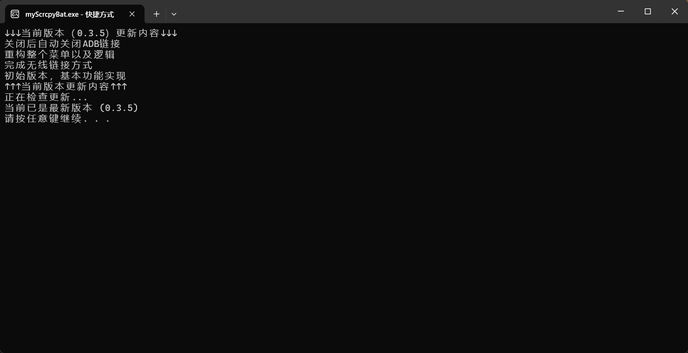

# 🐱 SCRCPY 简易使用界面 (Windows Batch 版)

基于 **scrcpy v3.3.2** 编写的 Windows 批处理脚本，打包为exe，自动释放文件，提供可视化菜单、无线连接、音频增强和自定义参数功能。
无需安装，双击运行即用

---

## 🐾 作者 **烟小雨** 

说明：可下载源码继续修改，无技术难度，只是简单封装命令，方便自己以及不懂命令行的人使用
---


## 🌟 功能特性

* 支持 USB & 无线连接 Android 设备
* 自定义分辨率、帧率、音频比特率和音频源
* 增强音频功能
* 摄像头镜像支持（Android 12+）
* 自定义 scrcpy 参数组合
* 默认设备和默认参数保存
* 快捷键说明和帮助
* 自动检查更新

---

## 📷 界面示意图

**主菜单截图**




**自定义参数菜单截图**


**无线连接菜单截图**


**退出程序自动关闭ADB连接**


---

## ⚡ 使用方法

1. 发布版本
2. 解压缩文件夹
3. 根据菜单选择操作：

| 功能         | 说明                    |
| ---------- | --------------------- |
| 基本连接       | USB 直连，快速启动           |
| 默认参数连接     | 使用保存的默认参数             |
| 自定义参数连接    | 设置分辨率、帧率、音频等          |
| 无线连接设置     | 初次 USB 获取 IP 后可直接无线连接 |
| 默认参数设置     | 修改默认参数和设备             |
| 清理 ADB 并退出 | 释放 ADB 资源，关闭脚本        |

---

## 🎨 默认参数设置

| 参数    | 示例值                     | 说明             |
| ----- | ----------------------- | -------------- |
| 分辨率   | 1080 / 720              | 输出分辨率          |
| 帧率    | 30 / 60                 | 屏幕刷新帧率         |
| 音频比特率 | 128K / 256K             | 支持 8M 高质量      |
| 音频源   | output / mic / playback | 可选 Android 音频源 |
| 默认设备  | 设备序列号                   | 可选 USB 或无线设备   |

---

## 🔑 快捷键说明

| 快捷键           | 功能          |
| ------------- | ----------- |
| MOD+f         | 全屏          |
| MOD+h / 中键    | HOME        |
| MOD+b / Back  | BACK        |
| MOD+s         | APP\_SWITCH |
| MOD+m         | MENU        |
| MOD+p         | POWER       |
| MOD+o         | 关闭屏幕        |
| MOD+r         | 屏幕旋转        |
| MOD+n         | 展开通知        |
| MOD+c / MOD+v | 剪贴板复制/粘贴    |
| 拖动 APK 文件     | 安装应用        |
| 拖动其他文件        | 推送到设备       |

---

## 📡 无线连接流程图

```
[图示位置：无线连接操作流程]
USB 连接 → 获取设备 IP → 启用 TCP/IP → 保存 IP → 下次直接无线连接
```

---

## ⚙️ 配置文件说明

* 文件名：`scrcpy-config.ini`
* 保存默认参数、设备序列号、无线 IP
* 可手动编辑或通过菜单修改

---

## ⬆️ 更新机制

* 脚本自动检测 GitHub 最新版本
* 显示版本号、更新时间、更新地址

---

## ⚠️ 注意事项

* 请勿直接关闭窗口，否则 ADB 资源无法释放
* 首次无线连接需要 USB 连接设备
* Windows 防火墙或网络限制可能导致无线连接失败

---


## 🧋请作者喝杯奶茶🧋


---